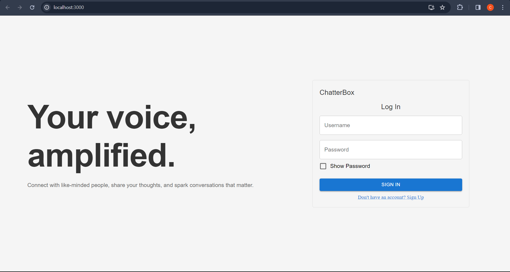
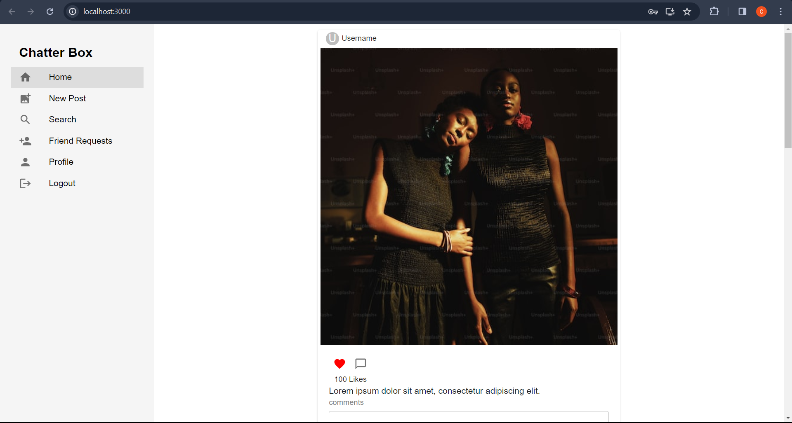

## Chatter Box: Your Gateway to Friendship and Fun

### **Technology Stack:**

* **Front-end:** Built with React and MUI for a sleek and responsive user interface.
* **Back-end:** Powered by Node.js and Express for high-performance API development.
* **Database:** Securely stores your data in MongoDB for a fast and efficient experience.

### Getting Started:

1. Clone the repository [https://github.com/charan1409/chatterbox](https://github.com/charan1409/chatterbox)
2. And install the node modules in both client and server. And also add mongo URI in .env file along with salt rounds.
3. And then start both servers to view the website.
4. Click "Sign Up" and create your account with your email, username, and password.

Here are some pictures of the website

